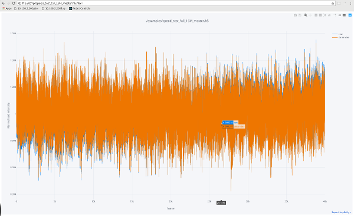

# Sum and analyse Eiger data for intensity statistics
The purpose of this repo is to provide the scientific community with a package for analysing intensity statistics from data collected on [Dectris](https://www.dectris.com/) Eiger detectors.

The package aims to
  - Take a diffuse scatter dataset in hdf5-format as input (procedure [here](./examples/Eiger_diffuse_scatter.pdf))
  - Access the frames via [ALBULA](https://www.dectris.com/products/albula-software)
  - Filter out pixels below and above thresholds
  - Sum all pixels on each frame and return the sums as a reduced dataset
  - [Detrend](https://www.scipy-lectures.org/intro/scipy/auto_examples/plot_detrend.html) the reduced data
  - Produce descriptice statistics
  - Plot the reduced dataset as an interactive Plotly graph

The app should ideally be run on a multi-core machine as summing a large number of frames (1000+) can be quite time consuming.

Most of the underlying discussion happened at the High Data-Rate Macromolecular Crystallography [meeting](http://www.medsbio.org/meetings/AsCA_Dec18_HDRMX_Meeting.html) 6-7 December 2018, Auckland, New Zealand.

## Installation
```
pip install -r requirements.txt
```

Note that **Redis** is commented out from the requirements.txt file by default. If you already have a Redis NOSQL database up and running and want to use it for this application, go ahead and uncomment it before installing. The config.yaml file will also need to be updated with your local Redis IP address.

We have not integrated ALBULA into our Python library, but instead import it as a system call when needed. Update the config.yaml file with your local path. Also, because ALBULA currently only runs on legacy Python, the code is divided into a few files:

| File | Contents | Python version |
| ------ | ------ | ------ |
|app.py| Calls the other two files | 3.6 |
|sum_eiger_frames.py| Reads in master file with albula, filters and sums pixels, writes out data as redis key or pickled file |2.7|
|plot_eiger_sums.py| Reads in data from redis or file, detrends, calculates statistics, and plots data |3.6|

------------------

## Example run
##### Edit config.yaml
Ideally the only file you should need to edit to run the process.
```
in:
  master: /staff/eiger/data/speed_test_full_16M_master.h5
  start: 0                      #First frame to process
  end:   0                      #Last frame to process. Leave as 0 for all

filter:                         #Anything lower or higher than is masked out
  low:     0
  high: 4500

out:
  file: True                    #Write out results to file
  path: /tmp/                   #Needs trailing slash
  plot: True                    #Analyse and plot data
  redis: False                  #Post results to redis key
  prefix: summed_eiger_frames   #Redis key prefix
  expire: 1                     #redis key time-to-live in days

sys_settings:
  albula_path: /staff/eiger/dectris/albula/3.2/python/
  redis_ip: 10.108.24.9
  threads: 4
```

##### Run app.py
```
(venv) [daniel@SR03BM01MXDE01 sum-eiger-frames]$ ./app.py
[2018-12-19 13:01:27.916192] INFO: __main__: Reading in master file
[2018-12-19 13:01:33.135028] INFO: __main__: Running on 4 threads
[2018-12-19 13:01:33.199758] INFO: __main__: Processing frames 1 to 40000
[2018-12-19 13:01:49.357440] INFO: __main__: ...another 100 frames.
                          [...]
[2018-12-19 13:02:22.738184] INFO: __main__: ...another 100 frames.
[2018-12-19 13:02:37.771860] INFO: __main__: Output written to file /tmp/speed_test_full_16M_master.h5.pickle
[2018-12-19 12:59:03.744784] INFO: Plotter: Reading data from file.
[2018-12-19 12:59:03.746444] INFO: Plotter: Detrending data
[2018-12-19 12:59:03.791573] INFO: Plotter: Descriptive stats:
                  raw     detrended
  count  4.000000e+04  4.000000e+04
  mean   6.485052e+06  6.485052e+06
  std    8.944226e+03  8.884134e+03
  CV%    1.379207e-01  1.369940e-01  <--- Coefficient of variation i.e. std/mean*100
  min    6.448255e+06  6.447553e+06
  25%    6.478904e+06  6.478976e+06
  50%    6.484958e+06  6.484955e+06
  75%    6.491091e+06  6.491049e+06
  max    6.521028e+06  6.519827e+06
[2018-12-19 12:59:03.791881] INFO: Plotter: Data description saved as /tmp/speed_test_full_16M_master.h5.csv
[2018-12-19 12:59:08.574857] INFO: Plotter: Plot saved as /tmp/speed_test_full_16M_master.h5.html

```

------------------

## Example output
[](./examples/speed_test_full_16M_master.h5.png)

##### Files generated
| File | Content |
| ------ | ------ |
| ...master.h5.pickle | Pickled list of intensity per frame |
| ...master.h5.csv | Descriptive statistics of dataset |
| ...master.h5.html | Plotly graph of raw and detrended data |

-------------

